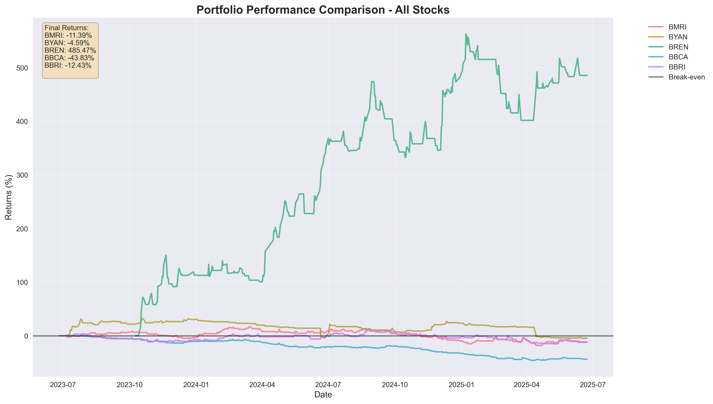

# When 10% Matters: A Tale of Two Mindsets Through the Eyes of a Young Investor


[](https://pandas.pydata.org/)
[](https://pypi.org/project/yfinance/)
[](https://matplotlib.org/)
[](https://seaborn.pydata.org/)



## 📈 Overview

This project compares two investment strategies through algorithmic trading simulation:

- **Greedy Algorithm**: Makes immediate buy/sell decisions based on local optimization
- **Dynamic Programming**: Uses optimal substructure to make globally optimal trading decisions

The simulation analyzes Indonesian stock market data (BBCA, BBRI, BMRI, BREN, BYAN) to demonstrate how different algorithmic approaches can impact investment returns, showing when that crucial 10% difference in strategy really matters.

## 🚀 Features

- **Dual Algorithm Comparison**: Side-by-side analysis of Greedy vs Dynamic Programming strategies
- **Real Market Data**: Uses Yahoo Finance API to fetch actual Indonesian stock prices
- **Comprehensive Analytics**: Detailed portfolio performance tracking and visualization
- **Risk Analysis**: Portfolio value progression and return calculations
- **Beautiful Visualizations**: Charts and graphs showing performance differences
- **Sequential Processing**: Optimized for reliability and consistency

## 📋 Dependencies

This project requires the following Python packages:

- **pandas**: Data manipulation and analysis
- **yfinance**: Yahoo Finance API for stock data
- **matplotlib**: Data visualization and plotting
- **seaborn**: Statistical data visualization

## 🛠️ Installation

### Prerequisites
- Python 3.8 or higher
- pip package manager

### Setup Instructions

1. **Clone the repository**
   ```bash
   git clone <repository-url>
   cd two-mindsets-investing-simulator
   ```

2. **Install dependencies**
   ```bash
   pip install -r requirements.txt
   ```

   Or install individually:
   ```bash
   pip install pandas yfinance matplotlib seaborn
   ```

3. **Verify installation**
   ```bash
   python -c "import pandas, yfinance, matplotlib, seaborn; print('All dependencies installed successfully!')"
   ```

## 🎯 How to Run

### Quick Start
Run the complete simulation with default settings:
```bash
python main.py
```

### What the Program Does

1. **Data Collection**: Downloads recent stock data for Indonesian stocks (BBCA, BBRI, BMRI, BREN, BYAN)
2. **Algorithm Execution**: Runs both Greedy and Dynamic Programming trading strategies
3. **Results Generation**: Creates detailed performance reports and visualizations
4. **Comparison Analysis**: Generates side-by-side comparison of both approaches

### Output Structure

After running, you'll find results in the following directories:

```
results/
├── greedy/
│   ├── combined_portfolio_comparison.png
│   ├── returns_summary_chart.png
│   ├── simulation_summary.csv
│   └── [individual stock analysis charts]
└── dp/
    ├── combined_portfolio_comparison.png
    ├── returns_summary_chart.png
    ├── simulation_summary.csv
    └── [individual stock analysis charts]
```

## 📊 Understanding the Results

### Key Metrics
- **Final Portfolio Value**: Total value after simulation period
- **Total Return**: Percentage gain/loss from initial capital
- **Trading Activity**: Number and timing of buy/sell decisions
- **Risk Exposure**: Time spent in market vs cash positions

### Visualization Types
- **Portfolio Performance**: Value progression over time
- **Algorithm Comparison**: Side-by-side strategy performance
- **Returns Summary**: Comparative return analysis across all stocks

## 🔧 Customization

### Modify Stock Selection
Edit the stock tickers in `src/data_downloader.py`:
```python
def get_tickers():
    return ['BBCA.JK', 'BBRI.JK', 'BMRI.JK', 'BREN.JK', 'BYAN.JK']
```

### Adjust Initial Capital
Change the starting capital in `main.py`:
```python
initial_capital = 10000000  # 10 million IDR
```

### Time Period Configuration
Modify the data collection period in `src/data_downloader.py`.

## 🧠 Algorithm Details

### Greedy Strategy
- Makes locally optimal decisions at each time step
- Quick decision-making based on immediate price movements
- Lower computational complexity
- May miss global optimization opportunities

### Dynamic Programming Strategy
- Uses optimal substructure principle
- Considers all possible future states
- Globally optimal solution within the given constraints
- Higher computational complexity but theoretically superior results

## 🤝 Contributing

1. Fork the repository
2. Create a feature branch (`git checkout -b feature/amazing-feature`)
3. Commit your changes (`git commit -m 'Add amazing feature'`)
4. Push to the branch (`git push origin feature/amazing-feature`)
5. Open a Pull Request

## ⚠️ Disclaimer

This software is for educational and research purposes only. It is not intended as financial advice. Past performance does not guarantee future results. Always consult with qualified financial advisors before making investment decisions.

## 👨‍💻 Author

**Kaindra**

---

*"Maaf saya skill issue."*